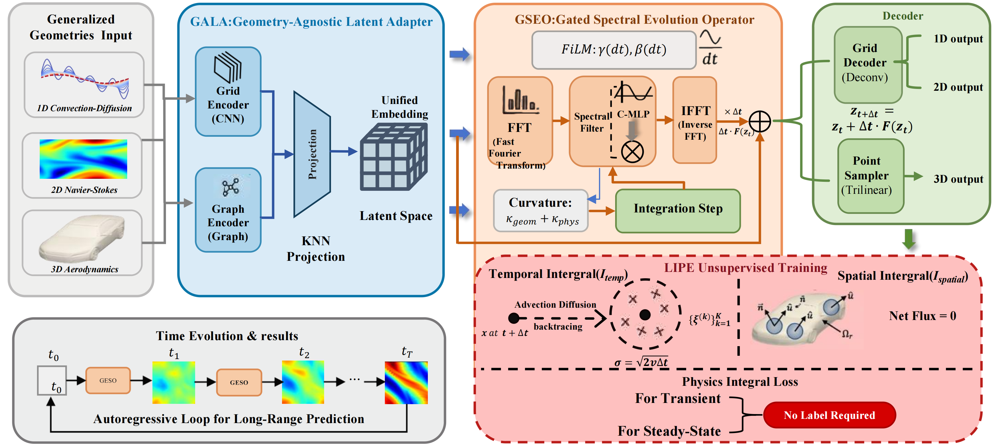

# UNOP: Unsupervised Neural Operator for Physics Simulation

[](https://www.python.org/downloads/)
[](https://pytorch.org/)
[](https://opensource.org/licenses/MIT)

Official implementation of **UNOP** (Unsupervised Neural Operator), a unified framework for physics simulation that learns from physical laws without labeled data.

<p align="center">
  
</p>

## 🎯 Key Features

- **LIPE** (Latent Integral Physics Embedding): Unsupervised learning via stochastic integration, replacing differential residuals with integral constraints.
- **GALA** (Geometry-Agnostic Latent Adapter): Projects irregular geometries into regular latent space, unifying grids and point clouds.
- **GSEO** (Gated Spectral Evolution Operator): Spectral modeling with curvature-aware gating for long-horizon stability.

## 🔧 Installation

### 1. Clone the repository
```bash
git clone https://github.com/xinrrr0408/UNOP.git
cd UNOP